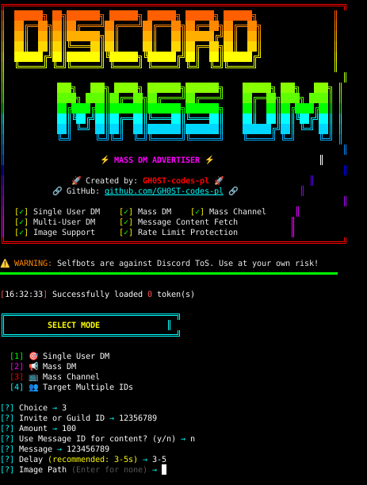

# Discord Mass DM Advertiser

<div align="center">


### 🚀 Made by [GH0ST-codes-pl](https://github.com/GH0ST-codes-pl)



*A powerful multi-functional Discord selfbot for automated direct messaging*

[English](#-english) | [Polski](#-polski)

</div>

---

## 🇺🇸 English

### ⚠️ Disclaimer

**This tool is for educational purposes only.** Selfbots are against Discord's Terms of Service. Using this tool may result in account termination. The developer assumes no liability for any consequences arising from the use of this software. **Use at your own risk.**

### ✨ Features

- 🎯 **Single User DM** - Send targeted messages to specific user IDs with spam capability
- 📢 **Mass DM** - Scrape server members and send bulk direct messages
- 📺 **Mass Channel Messaging** - Send messages to all channels in a server
- 🖼️ **Image Support** - Attach images to your messages
- ⚡ **Header Caching** - Optimized performance with intelligent caching
- 🛡️ **Advanced Anti-Ban** - Random delays, **Proxy support**, and **Spintax** (`{hi|hello}`)
- 🔄 **Multi-Token Support** - Use multiple accounts simultaneously
- 🎲 **Human-like Behavior** - Random delays and **Custom Status (Rich Presence)**
- 👥 **Target Multiple IDs** - Send messages to a specific list of User IDs
- 📜 **Message Content Fetch** - Use content from an existing Discord message
- 🛰️ **Webhook Logging** - Send campaign reports directly to your Discord server
- 📊 **Real-time Stats** - Monitor success, failures, and rate limits in real-time
- 🖤 **Blacklist** - Skip specific users or server IDs automatically
- 🔍 **Filtering** - Scrape only Online/DND/Idle users and exclude bots
- ✉️ **Embed Support** - Send professional looking Embeds via JSON

---

## 📋 Table of Contents

- [Installation](#-installation)
  - [Windows](#windows)
  - [Linux](#linux)
  - [macOS](#macos)
  - [Termux (Android)](#termux-android)
- [Configuration](#-configuration)
- [Usage](#-usage)
- [Features Explained](#-features-explained)
- [Troubleshooting](#-troubleshooting)

---

## 🔧 Installation

### Windows

#### Prerequisites
1. **Install Python 3.8 or higher**
   - Download from [python.org](https://www.python.org/downloads/)
   - ✅ **Important:** Check "Add Python to PATH" during installation

2. **Install Git** (Optional, for cloning)
   - Download from [git-scm.com](https://git-scm.com/download/win)

#### Installation Steps

1. **Download the repository**
   
   **Option A: Using Git**
   ```cmd
   git clone https://github.com/GH0ST-codes-pl/Discord-spammer-mass-dm-.git
   cd Discord-spammer-mass-dm-
   ```
   
   **Option B: Manual Download**
   - Click the green "Code" button → "Download ZIP"
   - Extract the ZIP file
   - Open Command Prompt in the extracted folder

2. **Create a virtual environment**
   ```cmd
   python -m venv .venv
   .venv\Scripts\activate
   ```

3. **Install dependencies**
   ```cmd
   pip install -r requirements.txt
   ```

4. **Configure tokens** (see [Configuration](#-configuration))

5. **Run the bot**
   ```cmd
   python main.py
   ```

---

### Linux

#### Prerequisites
Most Linux distributions come with Python pre-installed. Verify with:
```bash
python3 --version
```

If not installed:
```bash
# Debian/Ubuntu
sudo apt update
sudo apt install python3 python3-pip python3-venv git

# Fedora
sudo dnf install python3 python3-pip git

# Arch Linux
sudo pacman -S python python-pip git
```

#### Installation Steps

1. **Clone the repository**
   ```bash
   git clone https://github.com/GH0ST-codes-pl/Discord-spammer-mass-dm-.git
   cd Discord-spammer-mass-dm-
   ```

2. **Create a virtual environment**
   ```bash
   python3 -m venv .venv
   source .venv/bin/activate
   ```

3. **Install dependencies**
   ```bash
   pip install -r requirements.txt
   ```

4. **Configure tokens** (see [Configuration](#-configuration))

5. **Run the bot**
   ```bash
   python3 main.py
   ```

---

### macOS

#### Prerequisites

1. **Install Homebrew** (if not already installed)
   ```bash
   /bin/bash -c "$(curl -fsSL https://raw.githubusercontent.com/Homebrew/install/HEAD/install.sh)"
   ```

2. **Install Python and Git**
   ```bash
   brew install python git
   ```

#### Installation Steps

1. **Clone the repository**
   ```bash
   git clone https://github.com/GH0ST-codes-pl/Discord-spammer-mass-dm-.git
   cd Discord-spammer-mass-dm-
   ```

2. **Create a virtual environment**
   ```bash
   python3 -m venv .venv
   source .venv/bin/activate
   ```

3. **Install dependencies**
   ```bash
   pip install -r requirements.txt
   ```

4. **Configure tokens** (see [Configuration](#-configuration))

5. **Run the bot**
   ```bash
   python3 main.py
   ```

---

### Termux (Android)

#### Prerequisites

1. **Install Termux** from [F-Droid](https://f-droid.org/packages/com.termux/) (NOT Google Play Store)

2. **Update packages**
   ```bash
   pkg update && pkg upgrade
   ```

3. **Install required packages**
   ```bash
   pkg install python git
   ```

#### Installation Steps

1. **Clone the repository**
   ```bash
   git clone https://github.com/GH0ST-codes-pl/Discord-spammer-mass-dm-.git
   cd Discord-spammer-mass-dm-
   ```

2. **Create a virtual environment**
   ```bash
   python -m venv .venv
   source .venv/bin/activate
   ```

3. **Install dependencies**
   ```bash
   pip install -r requirements.txt
   ```

4. **Configure tokens** (see [Configuration](#-configuration))

5. **Run the bot**
   ```bash
   python main.py
   ```

---

## ⚙️ Configuration

### Getting Your Discord Token

1. Open Discord in your browser (not the app)
2. Press `F12` to open Developer Tools
3. Go to the **Console** tab
4. Paste this code and press Enter:
   ```javascript
   (webpackChunkdiscord_app.push([[''],{},e=>{m=[];for(let c in e.c)m.push(e.c[c])}]),m).find(m=>m?.exports?.default?.getToken!==void 0).exports.default.getToken()
   ```
5. Copy the token (without quotes)

### Adding Tokens

1. Open the file `data/tokens.txt`
2. Paste your Discord token(s), one per line:
   ```
   YOUR_DISCORD_TOKEN_HERE
   ANOTHER_TOKEN_IF_YOU_HAVE_MULTIPLE
   ```
3. Save the file

**⚠️ Security Warning:** Never share your tokens with anyone. They provide full access to your account.

### Advanced Configuration

- **Proxies:** Add your proxies to `data/proxies.txt` (format: `ip:port` or `user:pass@ip:port`).
- **Blacklist:** Add User IDs to `data/blacklist.txt` to ignore them.
- **Webhook:** Create `data/webhook.txt` and paste your Discord Webhook URL for remote logging.

---

## 🚀 Usage

### Starting the Bot

```bash
python main.py
```

### Interactive Prompts

The bot will ask you for the following information:

#### 1. **Mode Selection**
```
[1] Single User    - Send messages to a specific user ID
[2] Mass DM        - Send messages to all members in a server
[3] Mass Channel   - Send messages to all channels in a server
[4] Target Multiple IDs - Send messages to a specific list of User IDs
```

#### 2. **Target Configuration**

**For Mode 4 (Target Multiple IDs):**
- `User IDs`: Enter IDs separated by commas (e.g. `ID1,ID2,ID3`) OR a path to a file (e.g. `data/users.txt`)

**For Mode 1 (Single User):**
- `User ID`: The Discord user ID to target
- `Amount`: Number of messages to send

**For Mode 2 (Mass DM):**
- `Invite or Guild ID`: Server invite code (e.g., `abc123`) or Guild ID
- `Channel ID`: Required if using Guild ID (for member scraping)

**For Mode 3 (Mass Channel):**
- `Invite or Guild ID`: Server invite code or Guild ID
- `Amount`: Multiplier for channel messaging

#### 3. **Message Settings**
- `Message`: The message content (use `\n` for new lines)
- `Delay`: Time between messages in seconds (recommended: 3-5s)
  - Default: 3 seconds
  - Lower values = higher ban risk
- `Use Message ID`: Choose `y` to fetch content from an existing message
  - `Message Channel ID`: The ID of the channel where the message is
  - `Message ID`: The ID of the message to fetch content from
- `Image Path`: Path to an image file (optional, press Enter to skip)

### Example Usage

```
[1] Single User
[2] Mass DM
[3] Mass Channel

[?] Choice -> 2
[?] Invite or Guild ID -> abc123xyz
[?] Message -> Hello! Check out this cool server!
[?] Delay (recommended: 3-5s) -> 4
[?] Image Path (Enter for none) -> 
```

---

## 📚 Features Explained

### Single User DM
- Target a specific Discord user by their ID
- Send multiple messages (spam mode)
- Useful for testing or targeted messaging

### Mass DM
- Automatically scrapes members from a server
- Sends DMs to all scraped members
- Supports both invite codes and Guild IDs
- Random delays prevent rate limiting

### Mass Channel Messaging
- Sends messages to all text channels in a server
- Multiplier option for repeated messaging
- Useful for server-wide announcements

### Rate Limit Protection
- **Random delays** between actions (1-4 seconds)
- **Extended cooldowns** on rate limit detection (10-15 seconds)
- **Human-like behavior** to avoid detection
- **Automatic token rotation** for multi-account setups

---

## 🛠️ Troubleshooting

### Common Issues

#### "No module named 'aiohttp'"
**Solution:** Make sure you activated the virtual environment and installed dependencies:
```bash
source .venv/bin/activate  # Linux/Mac
.venv\Scripts\activate     # Windows
pip install -r requirements.txt
```

#### "Invalid account" or "Locked account"
**Solution:** 
- Your token may be expired or invalid
- Your account may be banned or locked
- Get a fresh token using the method in [Configuration](#-configuration)

#### "Ratelimited" messages
**Solution:**
- Increase the delay between messages (5-10 seconds recommended)
- Use fewer tokens simultaneously
- Wait before retrying

#### Bot crashes or freezes
**Solution:**
- Check your internet connection
- Ensure tokens are valid
- Try running with a single token first
- Check Discord API status at [discordstatus.com](https://discordstatus.com)

### Getting Help

If you encounter issues:
1. Check the [Issues](https://github.com/GH0ST-codes-pl/Discord-spammer-mass-dm-/issues) page
2. Create a new issue with:
   - Your operating system
   - Python version (`python --version`)
   - Error message (if any)
   - Steps to reproduce

---

## 📜 License

This project is licensed under the MIT License - see the LICENSE file for details.

---

## 🤝 Contributing

Contributions are welcome! Feel free to:
- Report bugs
- Suggest new features
- Submit pull requests

---

## ⭐ Support

If you find this project useful, please consider giving it a star ⭐

---

<div align="center">

### 🚀 Made with ❤️ by [GH0ST-codes-pl](https://github.com/GH0ST-codes-pl)

**Remember: Use responsibly and at your own risk!**

</div>

---
---

## 🇵🇱 Polski

### ⚠️ Zastrzeżenie

**To narzędzie służy wyłącznie celom edukacyjnym.** Selfboty są niezgodne z Regulaminem Discorda. Użycie tego narzędzia może skutkować zablokowaniem konta. Twórca nie ponosi odpowiedzialności za jakiekolwiek konsekwencje wynikające z użycia tego oprogramowania. **Używasz na własną odpowiedzialność.**

### ✨ Funkcje

- 🎯 **Single User DM** - Wysyłaj wiadomości do konkretnych ID z możliwością spamowania
- 📢 **Mass DM** - Pobieraj członków serwera i wysyłaj masowe wiadomości prywatne
- 📺 **Mass Channel** - Wysyłaj wiadomości na wszystkie kanały serwera
- 🖼️ **Obsługa Obrazów** - Dołączaj obrazy do wiadomości
- ⚡ **Cache Nagłówków** - Zoptymalizowana wydajność
- 🛡️ **Zaawansowany Anti-Ban** - Losowe opóźnienia, **Obsługa Proxy** i **Spintax** (`{cześć|siema}`)
- 🔄 **Wsparcie Wielu Tokenów** - Używaj wielu kont jednocześnie
- 🎲 **Zachowanie Jak Człowiek** - Losowe opóźnienia i **Własny Status (Rich Presence)**
- 👥 **Targetowanie Wielu ID** - Wysyłaj wiadomości do konkretnej listy ID
- 📜 **Pobieranie Treści Wiadomości** - Użyj treści z istniejącej wiadomości Discord
- 🛰️ **Webhook Logging** - Raporty z kampanii prosto na Twój serwer Discord
- 📊 **Statystyki Live** - Monitoruj sukcesy i błędy w czasie rzeczywistym
- 🖤 **Czarna Lista** - Automatycznie omijaj konkretne osoby lub serwery
- 🔍 **Filtrowanie** - Scrapuj tylko osoby Online/Zaraz Wracam i omijaj boty
- ✉️ **Wsparcie Embedów** - Wysyłaj profesjonalne Embedy przez format JSON

---

## 📋 Spis Treści

- [Instalacja](#-instalacja)
  - [Windows](#windows-1)
  - [Linux](#linux-1)
  - [macOS](#macos-1)
  - [Termux (Android)](#termux-android-1)
- [Konfiguracja](#-konfiguracja)
- [Użycie](#-użycie)
- [Wyjaśnienie Funkcji](#-wyjaśnienie-funkcji)
- [Rozwiązywanie Problemów](#-rozwiązywanie-problemów)

---

## 🔧 Instalacja

### Windows

#### Wymagania Wstępne
1. **Zainstaluj Python 3.8 lub nowszy**
   - Pobierz z [python.org](https://www.python.org/downloads/)
   - ✅ **Ważne:** Zaznacz "Add Python to PATH" podczas instalacji

2. **Zainstaluj Git** (Opcjonalnie, do klonowania)
   - Pobierz z [git-scm.com](https://git-scm.com/download/win)

#### Kroki Instalacji

1. **Pobierz repozytorium**
   
   **Opcja A: Używając Git**
   ```cmd
   git clone https://github.com/GH0ST-codes-pl/Discord-spammer-mass-dm-.git
   cd Discord-spammer-mass-dm-
   ```
   
   **Opcja B: Ręczne Pobieranie**
   - Kliknij zielony przycisk "Code" → "Download ZIP"
   - Rozpakuj plik ZIP
   - Otwórz Wiersz Polecenia w rozpakowanym folderze

2. **Utwórz środowisko wirtualne**
   ```cmd
   python -m venv .venv
   .venv\Scripts\activate
   ```

3. **Zainstaluj zależności**
   ```cmd
   pip install -r requirements.txt
   ```

4. **Skonfiguruj tokeny** (zobacz [Konfiguracja](#-konfiguracja))

5. **Uruchom bota**
   ```cmd
   python main.py
   ```

---

### Linux

#### Wymagania Wstępne
Większość dystrybucji Linuxa ma preinstalowany Python. Sprawdź:
```bash
python3 --version
```

Jeśli nie jest zainstalowany:
```bash
# Debian/Ubuntu
sudo apt update
sudo apt install python3 python3-pip python3-venv git

# Fedora
sudo dnf install python3 python3-pip git

# Arch Linux
sudo pacman -S python python-pip git
```

#### Kroki Instalacji

1. **Sklonuj repozytorium**
   ```bash
   git clone https://github.com/GH0ST-codes-pl/Discord-spammer-mass-dm-.git
   cd Discord-spammer-mass-dm-
   ```

2. **Utwórz środowisko wirtualne**
   ```bash
   python3 -m venv .venv
   source .venv/bin/activate
   ```

3. **Zainstaluj zależności**
   ```bash
   pip install -r requirements.txt
   ```

4. **Skonfiguruj tokeny** (zobacz [Konfiguracja](#-konfiguracja))

5. **Uruchom bota**
   ```bash
   python3 main.py
   ```

---

### macOS

#### Wymagania Wstępne

1. **Zainstaluj Homebrew** (jeśli nie jest zainstalowany)
   ```bash
   /bin/bash -c "$(curl -fsSL https://raw.githubusercontent.com/Homebrew/install/HEAD/install.sh)"
   ```

2. **Zainstaluj Python i Git**
   ```bash
   brew install python git
   ```

#### Kroki Instalacji

1. **Sklonuj repozytorium**
   ```bash
   git clone https://github.com/GH0ST-codes-pl/Discord-spammer-mass-dm-.git
   cd Discord-spammer-mass-dm-
   ```

2. **Utwórz środowisko wirtualne**
   ```bash
   python3 -m venv .venv
   source .venv/bin/activate
   ```

3. **Zainstaluj zależności**
   ```bash
   pip install -r requirements.txt
   ```

4. **Skonfiguruj tokeny** (zobacz [Konfiguracja](#-konfiguracja))

5. **Uruchom bota**
   ```bash
   python3 main.py
   ```

---

### Termux (Android)

#### Wymagania Wstępne

1. **Zainstaluj Termux** z [F-Droid](https://f-droid.org/packages/com.termux/) (NIE z Google Play Store)

2. **Zaktualizuj pakiety**
   ```bash
   pkg update && pkg upgrade
   ```

3. **Zainstaluj wymagane pakiety**
   ```bash
   pkg install python git
   ```

#### Kroki Instalacji

1. **Sklonuj repozytorium**
   ```bash
   git clone https://github.com/GH0ST-codes-pl/Discord-spammer-mass-dm-.git
   cd Discord-spammer-mass-dm-
   ```

2. **Utwórz środowisko wirtualne**
   ```bash
   python -m venv .venv
   source .venv/bin/activate
   ```

3. **Zainstaluj zależności**
   ```bash
   pip install -r requirements.txt
   ```

4. **Skonfiguruj tokeny** (zobacz [Konfiguracja](#-konfiguracja))

5. **Uruchom bota**
   ```bash
   python main.py
   ```

---

## ⚙️ Konfiguracja

### Pobieranie Tokenu Discord

1. Otwórz Discord w przeglądarce (nie w aplikacji)
2. Naciśnij `F12` aby otworzyć Narzędzia Deweloperskie
3. Przejdź do zakładki **Console**
4. Wklej ten kod i naciśnij Enter:
   ```javascript
   (webpackChunkdiscord_app.push([[''],{},e=>{m=[];for(let c in e.c)m.push(e.c[c])}]),m).find(m=>m?.exports?.default?.getToken!==void 0).exports.default.getToken()
   ```
5. Skopiuj token (bez cudzysłowów)

### Dodawanie Tokenów

1. Otwórz plik `data/tokens.txt`
2. Wklej swój token(y) Discord, jeden w każdej linii:
   ```
   TWOJ_TOKEN_DISCORD_TUTAJ
   KOLEJNY_TOKEN_JESLI_MASZ_WIECEJ
   ```
3. Zapisz plik

**⚠️ Ostrzeżenie Bezpieczeństwa:** Nigdy nie udostępniaj swoich tokenów nikomu. Dają one pełny dostęp do Twojego konta.

### Zaawansowana Konfiguracja

- **Proxy:** Dodaj swoje proxy do `data/proxies.txt` (format: `ip:port` lub `użytkownik:hasło@ip:port`).
- **Czarna Lista:** Dodaj ID użytkowników do `data/blacklist.txt`, aby ich ignorować.
- **Webhook:** Stwórz plik `data/webhook.txt` i wklej URL Webhooka Discord dla zdalnych logów.

---

## 🚀 Użycie

### Uruchamianie Bota

```bash
python main.py
```

### Interaktywne Pytania

Bot zapyta Cię o następujące informacje:

#### 1. **Wybór Trybu**
```
[1] Single User    - Wysyłaj wiadomości do konkretnego ID użytkownika
[2] Mass DM        - Wysyłaj wiadomości do wszystkich członków serwera
[3] Mass Channel   - Wysyłaj wiadomości na wszystkie kanały serwera
[4] Target Multiple IDs - Wysyłaj wiadomości do konkretnej listy ID
```

#### 2. **Konfiguracja Celu**

**Dla Trybu 4 (Targetowanie Wielu ID):**
- `User IDs`: Wpisz ID oddzielone przecinkami (np. `ID1,ID2,ID3`) LUB ścieżkę do pliku (np. `data/users.txt`)

**Dla Trybu 1 (Single User):**
- `User ID`: ID użytkownika Discord do targetowania
- `Amount`: Liczba wiadomości do wysłania

**Dla Trybu 2 (Mass DM):**
- `Invite or Guild ID`: Kod zaproszenia na serwer (np. `abc123`) lub ID Serwera
- `Channel ID`: Wymagane przy użyciu ID Serwera (do scrapowania członków)

**Dla Trybu 3 (Mass Channel):**
- `Invite or Guild ID`: Kod zaproszenia lub ID Serwera
- `Amount`: Mnożnik dla wysyłania na kanały

#### 3. **Ustawienia Wiadomości**
- `Message`: Treść wiadomości (użyj `\n` dla nowych linii)
- `Delay`: Czas między wiadomościami w sekundach (zalecane: 3-5s)
  - Domyślnie: 3 sekundy
  - Niższe wartości = wyższe ryzyko bana
- `Use Message ID`: Wybierz `y`, aby pobrać treść z istniejącej wiadomości
  - `Message Channel ID`: ID kanału, na którym znajduje się wiadomość
  - `Message ID`: ID wiadomości, z której ma zostać pobrana treść
- `Image Path`: Ścieżka do pliku obrazu (opcjonalne, naciśnij Enter aby pominąć)

### Przykład Użycia

```
[1] Single User
[2] Mass DM
[3] Mass Channel

[?] Choice -> 2
[?] Invite or Guild ID -> abc123xyz
[?] Message -> Cześć! Sprawdź ten fajny serwer!
[?] Delay (recommended: 3-5s) -> 4
[?] Image Path (Enter for none) -> 
```

---

## 📚 Wyjaśnienie Funkcji

### Single User DM
- Targetuj konkretnego użytkownika Discord po jego ID
- Wysyłaj wiele wiadomości (tryb spam)
- Przydatne do testowania lub targetowanych wiadomości

### Mass DM
- Automatycznie scrapuje członków z serwera
- Wysyła DM do wszystkich zebranych członków
- Wspiera zarówno kody zaproszeń jak i ID Serwerów
- Losowe opóźnienia zapobiegają rate limitom

### Mass Channel Messaging
- Wysyła wiadomości na wszystkie kanały tekstowe serwera
- Opcja mnożnika dla powtarzanych wiadomości
- Przydatne do ogłoszeń na całym serwerze

### Ochrona przed Rate Limit
- **Losowe opóźnienia** między akcjami (1-4 sekundy)
- **Wydłużone przerwy** przy wykryciu rate limitu (10-15 sekund)
- **Zachowanie jak człowiek** aby uniknąć wykrycia
- **Automatyczna rotacja tokenów** dla konfiguracji z wieloma kontami

---

## 🛠️ Rozwiązywanie Problemów

### Częste Problemy

#### "No module named 'aiohttp'"
**Rozwiązanie:** Upewnij się, że aktywowałeś środowisko wirtualne i zainstalowałeś zależności:
```bash
source .venv/bin/activate  # Linux/Mac
.venv\Scripts\activate     # Windows
pip install -r requirements.txt
```

#### "Invalid account" lub "Locked account"
**Rozwiązanie:** 
- Twój token może być wygasły lub nieprawidłowy
- Twoje konto może być zablokowane
- Pobierz świeży token używając metody z [Konfiguracja](#-konfiguracja)

#### Komunikaty "Ratelimited"
**Rozwiązanie:**
- Zwiększ opóźnienie między wiadomościami (zalecane 5-10 sekund)
- Używaj mniej tokenów jednocześnie
- Poczekaj przed ponowną próbą

#### Bot się zawiesza lub crashuje
**Rozwiązanie:**
- Sprawdź połączenie internetowe
- Upewnij się, że tokeny są prawidłowe
- Spróbuj uruchomić z pojedynczym tokenem
- Sprawdź status API Discord na [discordstatus.com](https://discordstatus.com)

### Uzyskiwanie Pomocy

Jeśli napotkasz problemy:
1. Sprawdź stronę [Issues](https://github.com/GH0ST-codes-pl/Discord-spammer-mass-dm-/issues)
2. Utwórz nowy issue z:
   - Twoim systemem operacyjnym
   - Wersją Pythona (`python --version`)
   - Komunikatem błędu (jeśli występuje)
   - Krokami do odtworzenia problemu

---

## 📜 Licencja

Ten projekt jest licencjonowany na licencji MIT - zobacz plik LICENSE dla szczegółów.

---

## 🤝 Współpraca

Wkład jest mile widziany! Możesz:
- Zgłaszać błędy
- Sugerować nowe funkcje
- Wysyłać pull requesty

---

## ⭐ Wsparcie

Jeśli ten projekt jest dla Ciebie przydatny, rozważ zostawienie gwiazdki ⭐

---

<div align="center">

### 🚀 Stworzone z ❤️ przez [GH0ST-codes-pl](https://github.com/GH0ST-codes-pl)

**Pamiętaj: Używaj odpowiedzialnie i na własną odpowiedzialność!**

</div>
